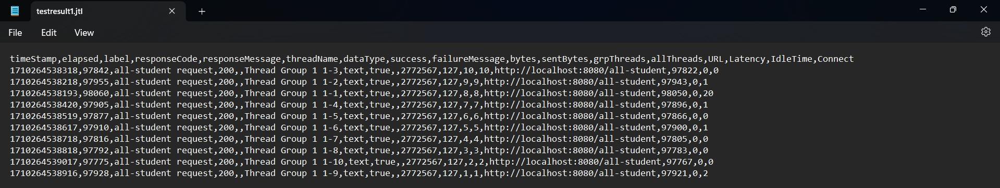
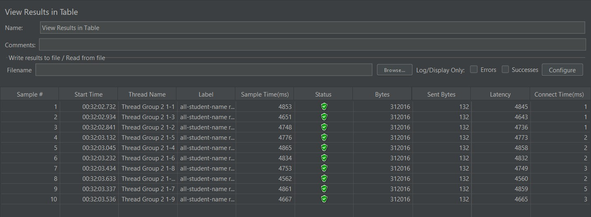
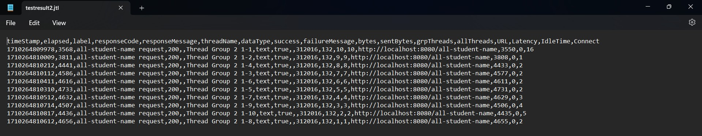
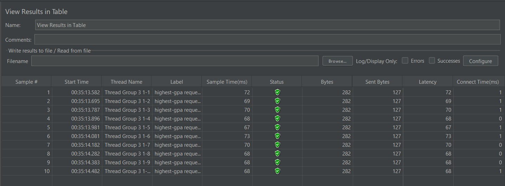
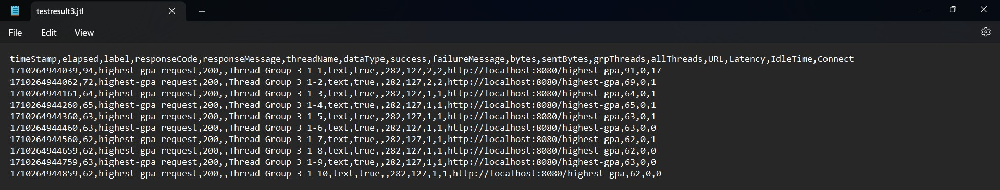

# Mahoga Aribowo Heryasa

# 2206025230

<b><h2>Tutorial 5</h2></b>

## JMeter Table Report dan Test Result

### `/all-student`
 
- JMeter table report (before optimization)

    </img>

- Test result (before optimization)

  </img>

- JMeter table report (after optimization)

  </img>

- salah satu hasil IntelliJ Profiler (execution time)

  | Before Optimization | After Optimization | Performance improvement % |
  |---------------------|--------------------|--------------------------|
  | 5107 ms             | 972 ms             | 80.97%                   |

### `/all-student-name`

- JMeter table report (before optimization)

  </img>

- Test result (before optimization)

  </img>

- JMeter table report (after optimization)

  </img>

- salah satu hasil IntelliJ Profiler (execution time)

  | Before Optimization | After Optimization | Performance improvement % |
  |---------------------|--------------------|---------------------------|
  | 652 ms              | 122 ms             | 81.29%                    |

### `/higest-gpa`

- JMeter table report (before optimization)

  </img>

- Test result (before optimization)

  </img>

- JMeter table report (after optimization)

  </img>

- salah satu hasil IntelliJ Profiler (execution time)

  | Before Optimization | After Optimization | Performance improvement % |
  |---------------------|--------------------|---------------------------|
  | 121 ms              | 33 ms              | 72.73%                    |

### Conclusion

Berdasarkan perbandingan hasil *sample-time JMeter report* dan perbandingan *execution time IntelliJ Profiler*, terdapat kenaikan performance untuk fungsi-fungsi yang di optimisasi. Hal ini ditandakan dengan *sample-time JMeter* dan *execution time IntelliJ Profiler* yang relatif menurun sehingga program berjalan lebih cepat. Secara keseluruhan, dapat disimpulkan optimisasi yang saya lakukan menghasilkan performance yang relatif lebih baik berdasarkan penggunaan JMeter dan IntelliJ Profiler sebagai alat ukur. 

